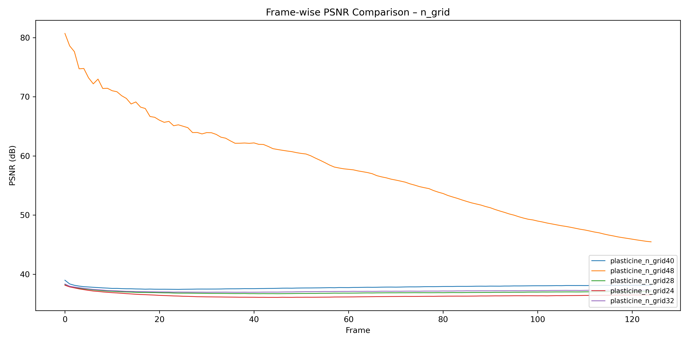
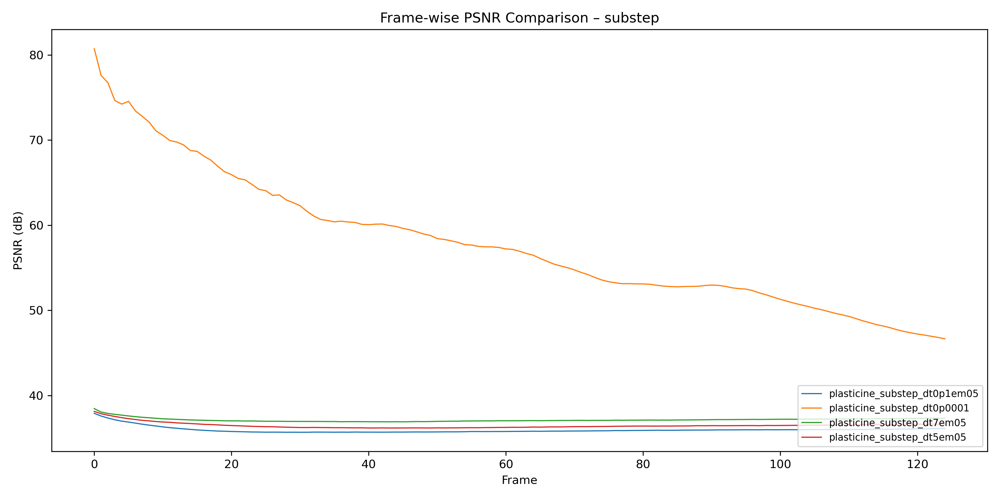
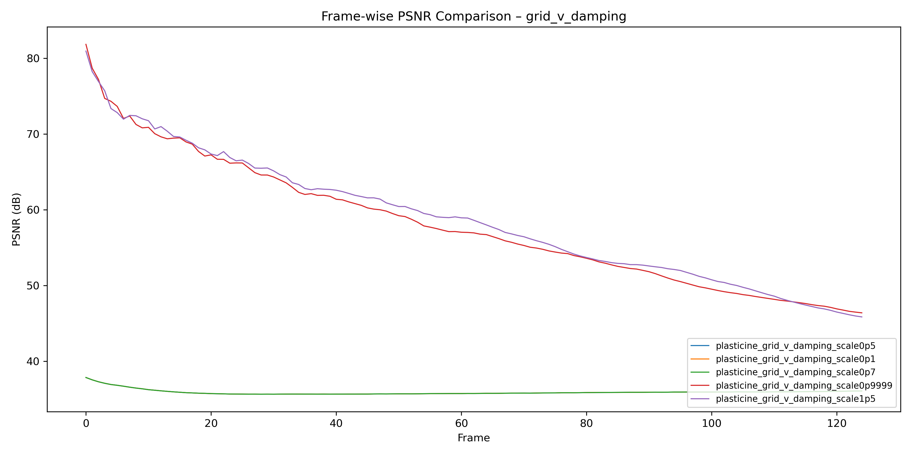
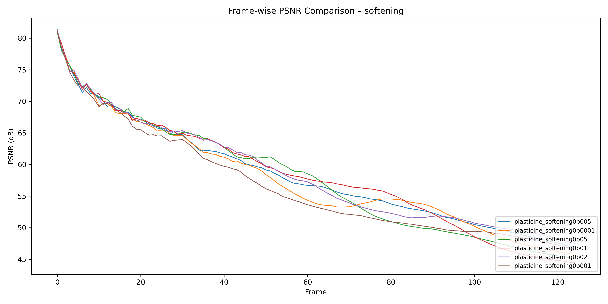

# PhysGaussian Simulation Assignment Report

This project explores physically-based simulations by combining Gaussian Splatting with MPM (Material Point Method). The objective is to analyze the visual and quantitative impact of different physical parameters on simulation results.


## Project Structure

```
config/
├── plasticine/
│   └── plasticine_{parameter}.json     # Config files for plasticine experiments
├── sand/
│   └── sand_{parameter}.json           # Config files for sand experiments
resource/
├── sand_{parameter}.gif                # Simulation result animations (converted from mp4)
├── plasticine_{parameter}.gif
script/
├── compute_psnr.py                     # Computes PSNR values using baseline images as reference
├── mp4_to_gif.py                       # Converts simulation output .mp4 files to .gif format
├── sweep_config.py                     # Generates multiple config files by varying a parameter from the baseline

```
## Script Using Example

### `compute_psnr.py`

This script calculates the average **PSNR (Peak Signal-to-Noise Ratio)** between two folders of `.png` images. It is typically used to compare output images from a simulation against a baseline to quantify visual similarity.

**Usage:**

```bash
python script/compute_psnr.py \
  --folder_path1 ./output/sand/sand_baseline_config/images \
  --folder_path2 ./output/sand/sand_softening0p01/images
```

- `folder_path1`: Path to the baseline image folder.
- `folder_path2`: Path to the comparison image folder.
- **Note**: Both folders must contain PNG files with matching filenames.
- Output: Prints the average PSNR value across all images.

---

### `mp4_to_gif.py`

This script converts a simulation output `.mp4` video into a `.gif` image for quick visual inspection or inclusion in reports.

**Usage:**

```bash
python script/mp4_to_gif.py \
  --input_mp4 ./output/sand/sand_n_grid64/video.mp4 \
  --output_gif ./resource/sand_n_grid64.gif
```

- `--input_mp4`: Path to the MP4 file generated by simulation.
- `--output_gif`: Path to save the resulting GIF.

---

### `sweep_config.py`

This script automatically generates multiple config files by varying selected parameters from a single baseline config. It is used to systematically test different values for `n_grid`, `substep_dt`, `grid_v_damping_scale`, and `softening`.

**Default behavior (no arguments needed):**

```bash
python script/sweep_config.py
```

- It reads the baseline config from:

  ```
  /tmp2/yctseng/2025spring/ev/hw3-chabu-tseng/config/sand/sand_baseline_config.json
  ```

- For each parameter listed in `SWEEP_PARAMETERS`, it creates multiple modified config files.
- The output configs are saved in:

  ```
  /tmp2/yctseng/2025spring/ev/hw3-chabu-tseng/config/sand/
  ```

- Filenames are formatted like: `sand_softening0p01.json`, `sand_n_grid96.json`, etc.

**To generate config files for other materials (e.g., plasticine):**
- You can modify the following two variables inside `sweep_config.py`:
  - `BASE_CONFIG_PATH`: change to a plasticine baseline config.
  - `SWEEP_PARAMETERS`: redefine which parameters and values to sweep.
- This allows flexible reuse of the script to produce parameter sweep configs for any material or scenario.

## Part 1 – PhysGaussian Baseline

In this part, I construct two baseline configurations using the **PhysGaussian** simulation framework for two different materials: `plasticine` and `sand`. Each baseline is designed to serve as a stable starting point for parameter variation experiments.

### Plasticine Baseline


The plasticine material is modeled as a relatively soft, dissipative medium. The following parameters were chosen:

```json
{
  "n_grid": 48,
  "substep_dt": 1e-4,
  "grid_v_damping_scale": 0.9999,
  "softening": 1e-2
}
```
This simulation contains 125 frames, as the plasticine scenario is longer in duration and requires finer temporal resolution.

The configuration is the highest stable setting observed for plasticine under memory constraints. Increasing n_grid beyond 48 or substep_dt beyond 1e-4 consistently resulted in CUDA memory errors or simulation crashes due to excessive particle count or grid pressure. This baseline maintains a good balance between stability and resolution for soft materials.

### Sand Baseline


The sand material exhibits more rigid, granular dynamics and typically requires higher resolution and finer time integration. The following parameters were used:
```json
{
  "n_grid": 200,
  "substep_dt": 2e-5,
  "grid_v_damping_scale": 0.9999,
  "softening": 1e-2
}
```
This simulation contains 50 frames, which is sufficient for capturing the falling and settling behavior of sand.

The baseline uses a very fine grid (n_grid = 200) to capture detailed granular interactions and surface effects. The time step 2e-5 ensures stability given the high stiffness and contact density of sand particles. The damping factor 0.9999 allows for momentum preservation, enabling natural flow behavior. The softening value of 1e-2 prevents singularities and promotes numerical stability in high-density regions.

Both baselines serve as foundations for further single-parameter experiments, which are discussed in subsequent sections.

## Part 2 – Exploring MPM Parameter Effects
### Parameter Sweep Summary (Plasticine)

In this experiment, we vary four key physical simulation parameters for the `plasticine` material to evaluate their effects on the output quality and stability. Each parameter is tested independently, starting from the baseline configuration.

#### 1. `n_grid` – Grid Resolution
Defines the spatial resolution of the simulation grid. Higher values improve precision but increase memory usage.

**Tested values:**

- `24`
- `28`
- `32`
- `40`
- `48` (baseline)

<table>
  <tr>
    <td align="center"><br/>n_grid = 24</td>
    <td align="center"><br/>n_grid = 28</td>
    <td align="center"><br/>n_grid = 32</td>
    <td align="center"><br/>n_grid = 40</td>
    <td align="center"><br/>n_grid = 48 </td>
  </tr>
</table>



### Effect of `n_grid` on PSNR and Simulation Dynamics

In this experiment, the baseline was set to `n_grid = 48`, which captures more detailed collisions and physical interactions. As a result, other configurations with lower `n_grid` (e.g., 24–40) show much lower PSNR, not because they are unstable, but because their outputs visually differ from the high-resolution baseline.

Higher `n_grid` increases physical realism but may reduce PSNR due to more complex motion. Lower `n_grid` yields smoother, simpler results that differ from the baseline, resulting in lower visual similarity scores.

This shows that **PSNR is sensitive to physical resolution** and may not fully reflect simulation quality when comparing across grid settings.

#### 2. `substep_dt` – Simulation Substep Size
Controls the time step for each subframe. Smaller values improve numerical stability, while larger values reduce runtime.

**Tested values:**

- `1e-5`
- `5e-5`
- `7e-5`
- `1e-4` (baseline)

<table>
  <tr>
    <td align="center"><br/>substep_dt = 1e-4</td>
    <td align="center"><br/>substep_dt = 1e-5</td>
    <td align="center"><br/>substep_dt = 5e-5</td>
    <td align="center"><br/>substep_dt = 7e-5</td>
  </tr>
</table>



### Effect of `substep_dt` on PSNR and Motion Scale

This plot shows the PSNR for different values of `substep_dt`. The baseline uses `substep_dt = 1e-4`, which allows finer time resolution. Compared to that, other settings with larger `substep_dt` (e.g., `5e-5`, `7e-5`, `1e-4`) result in consistently lower PSNR.

One reason is that **smaller `substep_dt` leads to smaller per-frame motion**, which accumulates more slowly and stays closer to the baseline. With larger `substep_dt`, motion per frame becomes more aggressive, deviating faster from the baseline and lowering PSNR.

This is because in MPM solvers, each substep applies physical forces (like gravity, contact, internal stress) to particles. **A larger time step integrates more force at once**, resulting in more displacement per step. Conversely, **smaller `substep_dt` leads to finer, more stable updates**, which better preserve physical details across frames.


#### 3. `grid_v_damping_scale` – Velocity Damping Factor
Determines how much the velocity field is damped each step. Lower values add strong dissipation; higher values preserve momentum.

**Tested values:**

- `0.1`
- `0.5`
- `0.7`
- `0.9999` (baseline)
- `1.5`

<table>
  <tr>
    <td align="center"><br/>0.1000</td>
    <td align="center"><br/>0.5000</td>
    <td align="center"><br/>0.7000</td>
    <td align="center"><br/>0.9999</td>
    <td align="center"><br/>1.5000</td>
  </tr>
</table>



### Effect of `grid_v_damping_scale` on PSNR and Motion Persistence

This plot shows the PSNR for different values of `grid_v_damping_scale`. The baseline uses `grid_v_damping_scale = 0.9999`, which lightly damps the grid velocity and allows realistic momentum preservation. Settings with smaller damping factors (e.g., `0.1`, `0.5`, `0.7`) result in significantly lower PSNR.

One reason is that **lower `grid_v_damping_scale` suppresses velocity too aggressively**, causing particles to slow down unnaturally and settle too early. This divergence from the baseline becomes evident quickly, especially in long simulations, and results in a sharp drop in PSNR.

In contrast, **higher damping values like `0.9999` and `1.5` maintain velocity longer**, allowing particles to follow natural trajectories over time. The differences accumulate slowly, so PSNR remains high across most frames.

This happens because in MPM solvers, grid velocity updates directly influence particle advection. **Stronger damping truncates motion**, removing energy from the system too soon. **Weaker damping (values near or slightly above 1)** helps preserve the intended motion, resulting in smoother, more physically consistent simulations.


#### 4. `softening` – Particle Interaction Softening
Prevents numerical instability from hard contacts by smoothing interactions. Higher values reduce stiffness.

**Tested values:**

- `0.0001`
- `0.001`
- `0.005`
- `0.01`(baseline)
- `0.02` 
- `0.05`

<table>
  <tr>
    <td align="center"><br/>softening = 1e-4</td>
    <td align="center"><br/>softening = 1e-3</td>
    <td align="center"><br/>softening = 5e-3</td>
    <td align="center"><br/>softening = 1e-2</td>
    <td align="center"><br/>softening = 2e-2</td>
    <td align="center"><br/>softening = 5e-2</td>
  </tr>
</table>



### Effect of `softening` on PSNR and Contact Behavior

This plot shows the frame-wise PSNR for different values of `softening` in the plasticine simulation. The baseline uses `softening = 1e-2`, and the tested range includes values from `1e-5` to `5e-2`.

Overall, **the variation in PSNR across different softening values is relatively minor** throughout the simulation. All settings maintain a similar trend, with PSNR gradually decreasing over time as the simulation diverges from the baseline.

While the PSNR differences are small, we observe that:

- **Very large softening values** (e.g., `0.02`, `0.05`) tend to lead to a slightly faster PSNR decline in later frames.
- This may be due to **over-smoothing of particle contacts**, where softening reduces stress concentrations and makes the material behave more fluid-like.
- **Smaller softening values** (e.g., `0.001`, `0.005`) tend to better preserve the baseline shape and structure, maintaining marginally higher PSNR.

In conclusion, `softening` primarily affects **contact stiffness and shape retention**, but its impact on PSNR is subtle. Visual differences may still be noticeable (e.g., in deformation or sticking behavior), even if PSNR remains similar.

### BONUS: Designing an Auto-Inference Framework for Material Parameters

One possible approach is to extend PhysGaussian with a **parameter inference module** that learns to estimate material-related parameters (e.g., stiffness, damping, softening) from observations of a target material’s behavior. This framework can be designed as follows:

#### 1. Data Collection
Prepare a dataset of simulated or real-world materials with known parameters and observable motion (e.g., videos, trajectories, particle positions over time).

#### 2. Learnable Inverse Model
Train a neural network or differentiable physics-based model that takes as input:

- Initial geometry or particle configuration  
- Time-series data (e.g., positions or rendered frames)

and outputs a predicted set of material parameters.

#### 3. Loss Function
Define a loss between the target material's behavior and the behavior generated by PhysGaussian using the predicted parameters. For example:

- Image-based loss (e.g., MSE or LPIPS between rendered frames)  
- Trajectory matching loss (particle position sequences)  
- PSNR or structural similarity metrics

#### 4. Optimization or Meta-Learning
Use gradient descent or meta-learning to either:

- Fine-tune parameters per sample  
- Or train a global predictor that generalizes to unseen materials

#### 5. Optional: Feedback Loop
Integrate a loop where the predicted parameters are fed into simulation, the result is compared to ground truth, and the predictor is updated accordingly.

---

This kind of pipeline would allow PhysGaussian to adapt to arbitrary materials through **data-driven parameter estimation**, significantly expanding its applicability beyond hand-tuned simulations.


# Reference
```bibtex
@inproceedings{xie2024physgaussian,
    title     = {Physgaussian: Physics-integrated 3d gaussians for generative dynamics},
    author    = {Xie, Tianyi and Zong, Zeshun and Qiu, Yuxing and Li, Xuan and Feng, Yutao and Yang, Yin and Jiang, Chenfanfu},
    booktitle = {Proceedings of the IEEE/CVF Conference on Computer Vision and Pattern Recognition},
    year      = {2024}
}
```
